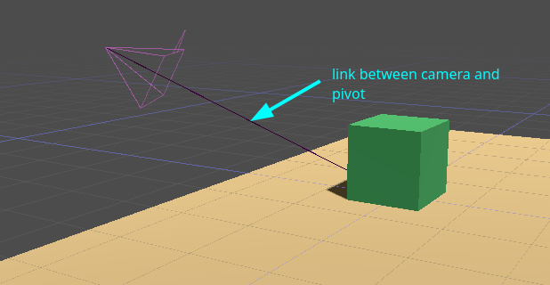
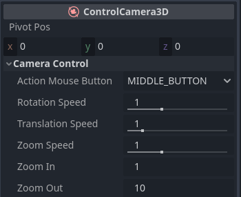

# ControlCamera3D add-on for Godot 4.x

**ControlCamera3D is an addon that provides a 3D camera with rotation, translation and zooming, like in Godot's editor**.

This repository contains the add-on and examples.

## Features

- Rotation of the camera around pivot point (`LEFT` or `MIDDLE` mouse button).
- Translation of the camera (with `SHIFT`).
- Zooming in/out with mouse's wheel (and pad).
- Works on desktop platforms and HTML5.

## Usage

**ControlCamera3D** node is used like **Camera3D** node. Place your camera in a 3D scene but unlike Camera3D, it will point itself to a point in space called *pivot*. By default, this point is placed at the origin of the global reference `Vector3(0,0,0)`.

This camera can rotate around this pivot ("middle click" by default), move laterally in the camera plane ("shift key") and also zoom in and out with the mouse wheel (or pad).

`ControlCamera3D` has lot of properties :

- The pivot's position `pivot_pos` that can be modified by the code and by the camera itself.
- `action_mouse_button` to choose the mouse button that triggers the rotation and translation of the camera (`LEFT` or `MIDDLE` buttons).

## License

Copyright © 2023 Laurent Dethoor

Unless otherwise specified, files in this repository are licensed under the
MIT license. See [LICENSE.md](LICENSE.md) for more information.
